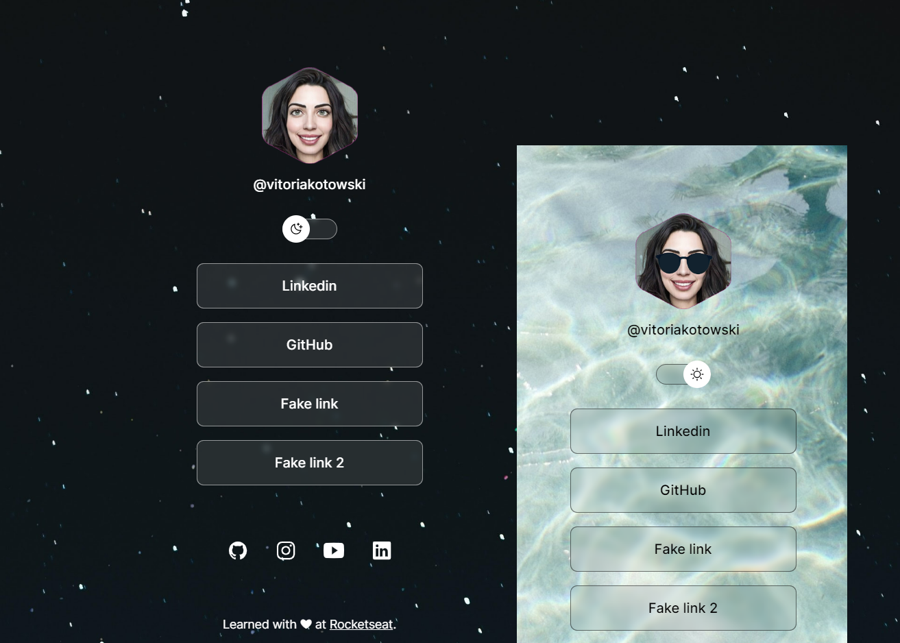

<h1 align="center"> DevLinks </h1>

Exclusive and free program, promoted by Rocketseat, for learning web technologies. Customized by Vitoria Kotowski.

  <a href="#-tecnologias">Technologies</a>&nbsp;&nbsp;&nbsp;|&nbsp;&nbsp;&nbsp;
  <a href="#-projeto">Project</a>&nbsp;&nbsp;&nbsp;|&nbsp;&nbsp;&nbsp;
  <a href="#-layout">Layout</a>&nbsp;&nbsp;&nbsp;|&nbsp;&nbsp;&nbsp;
  <a href="#memo-licença">License</a>

  

 

  

## 🚀 Technologies

This project was developed with the following technologies:

- HTML and CSS
- JavaScript
- Git and Github
- Figma

## 💻 Project

DevLinks is a link aggregator to use as an online business card.

## 🔖 Layout

You can view the original project layout through [THIS LINK](https://www.figma.com/community/file/1187422022288947321/DevLinks-%E2%80%A2-Projeto-Discover). You must have an account at [Figma](https://figma.com) to access it.

## 🚀 License

This project is licensed under the MIT license.

---

Made with ♥ by Rocketseat. [Join our community!](https://discord.gg/rocketseat)
